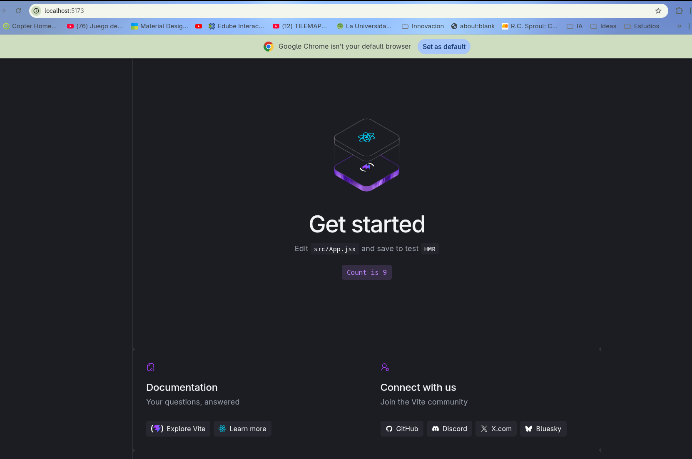
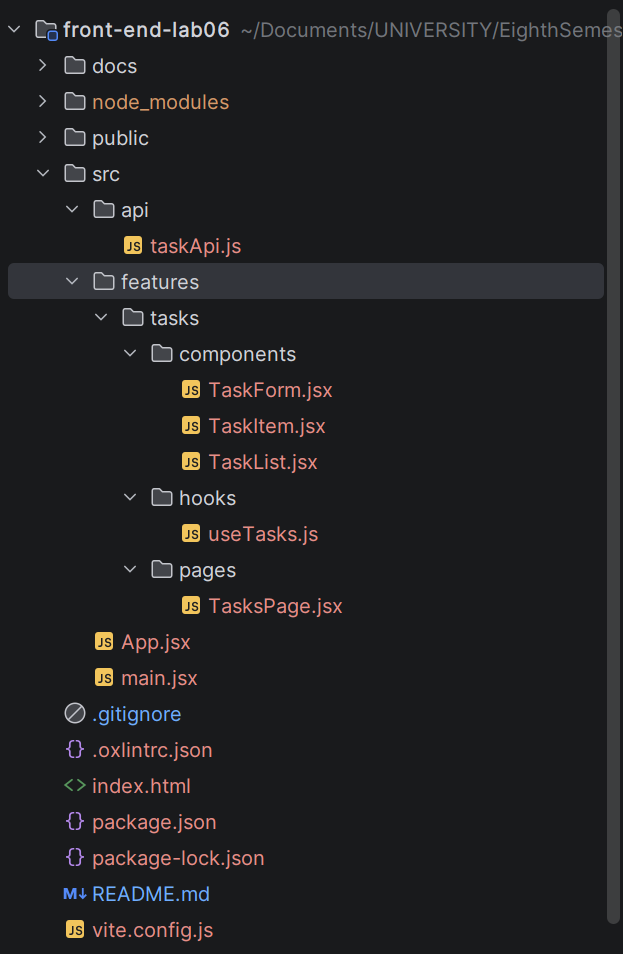
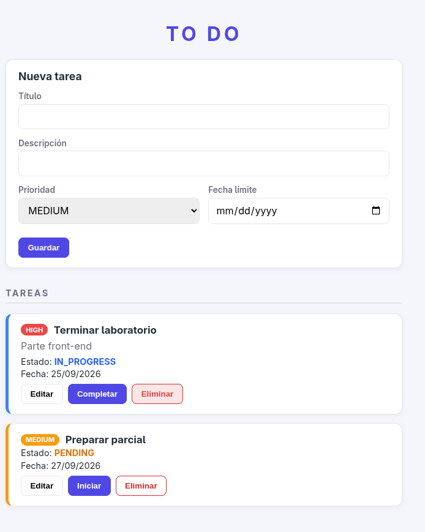
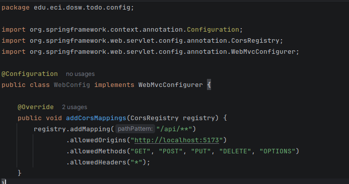
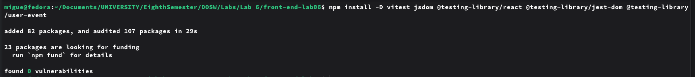
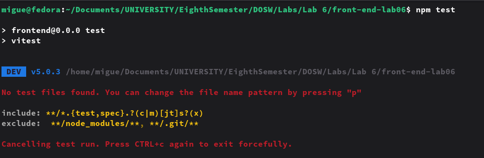
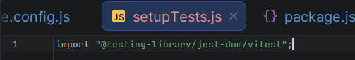
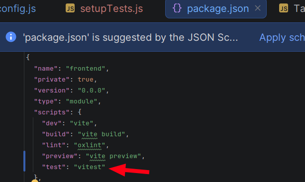
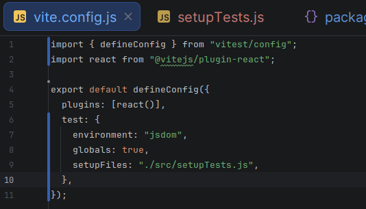
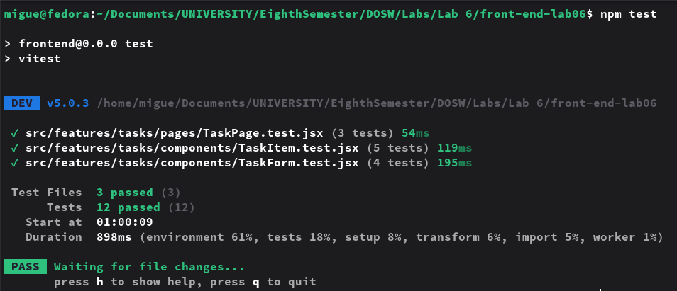

# LABORATORIO · ToDo FULL STACK

**Escuela Colombiana de Ingeniería Julio Garavito**  
**Curso:** Desarrollo y Operaciones de Software - DOSW  
**Caso de estudio:** ToDo · Sistema para gestión de tareas  
**Docente:** Rodrigo Gualtero

# FRONT-END
This repository manges the application front-end

#### NOTA 1: Los requerimientos y las descripcíón del proyecto se encunetran ubicados en el back-end en /docs/requirements/requiremnets.md

#### NOTA 2: Además se tiene en este README lo conserniente al desarrollo de la segunda parte del laboratorio 

---

# PARTE 11 · FRONT-END CON REACT

# 38. Crear React con Vite

Antes de usar este framework, es necesario descargar el framework de nodejs que ya incluye npm:

```bash
sudo dnf install nodejs
```

Desde la raíz:

```bash
npm create vite@latest frontend -- --template react
```

Instalar:

```bash
cd frontend
npm install
```

El README.md generado:

```text
# React + Vite

This template provides a minimal setup to get React working in Vite with HMR and some Oxlint rules.

Currently, two official plugins are available:

- [@vitejs/plugin-react](https://github.com/vitejs/vite-plugin-react/blob/main/packages/plugin-react) uses [Oxc](https://oxc.rs)
- [@vitejs/plugin-react-swc](https://github.com/vitejs/vite-plugin-react/blob/main/packages/plugin-react-swc) uses [SWC](https://swc.rs/)

## React Compiler

The React Compiler is not enabled on this template because of its impact on dev & build performances. To add it, see [this documentation](https://react.dev/learn/react-compiler/installation).

## Expanding the Oxlint configuration

If you are developing a production application, we recommend using TypeScript with type-aware lint rules enabled. Check out the [TS template](https://github.com/vitejs/vite/tree/main/packages/create-vite/template-react-ts) for information on how to integrate TypeScript and Oxlint's TypeScript related rules in your project.
```

Ejecutar:

```bash
npm run dev
```

Aplicación:

```text
http://localhost:5173
```



---

# 39. Estructura sugerida

```text
front-end-lab06/
├── docs
└── src/
    │
    ├── api/
    │   └── taskApi.js
    │
    ├── features/
    │   └── tasks/
    │       │
    │       ├── components/
    │       │   ├── TaskForm.jsx
    │       │   ├── TaskList.jsx
    │       │   └── TaskItem.jsx
    │       │
    │       ├── hooks/
    │       │   └── useTasks.js
    │       │
    │       └── pages/
    │           └── TasksPage.jsx
    │
    ├── App.jsx
    └── main.jsx
```
#### Scaffolding Front-End evidence



---

# 40. TaskForm

Crear un formulario para:

```text
Título
Descripción
Prioridad
Fecha límite
```

Debe servir para:

```text
Crear tarea
Editar tarea
```

---

# 41. TaskList

Mostrar:

```text
Título
Estado
Prioridad
Fecha límite
```

Acciones:

```text
Editar
Cambiar estado
Eliminar
```

---

# 42. Interfaz mínima

```text
-----------------------------------------------------
                    TO DO
-----------------------------------------------------

[ Nueva tarea ]

Título:       [________________________]

Descripción:  [________________________]

Prioridad:    [ MEDIUM v ]

Fecha límite: [ 2026-09-25 ]

              [ Guardar ]

-----------------------------------------------------

TAREAS

[HIGH] Terminar laboratorio
Estado: IN_PROGRESS
Fecha: 25/09/2026

[Editar] [Completar] [Eliminar]

-----------------------------------------------------

[MEDIUM] Preparar parcial
Estado: PENDING
Fecha: 27/09/2026

[Editar] [Iniciar] [Eliminar]

-----------------------------------------------------
```
Hasta esta parte ya hemos creado gran parte del front-end, y para visualizarlo rápidamente creamos un cóidgo temporal para el useTask.js y poder visualizar. Sin embargo, en el próximo paso haremos la versión correcta y mejoraremos un poco la interfaz.



---

# PARTE 12 · CONSUMO DE RECURSOS REST

# 43. Crear taskApi.js

Crear:

```text
src/api/taskApi.js
```

Ejemplo:

```javascript
const API_URL = "http://localhost:8080/api/v1/tasks";

export async function getTasks() {
    // TODO
}

export async function getTask(id) {
    // TODO
}

export async function createTask(task) {
    // TODO
}

export async function updateTask(id, task) {
    // TODO
}

export async function deleteTask(id) {
    // TODO
}
```

---

# 44. Crear useTasks

Crear:

```text
useTasks.js
```

Utilizar:

```text
useState
useEffect
```

Debe manejar:

```text
tasks
loading
error

loadTasks()
addTask()
editTask()
removeTask()
```

---

# 45. Configurar CORS

React:

```text
http://localhost:5173
```

Spring Boot:

```text
http://localhost:8080
```

Crear:

```text
config/WebConfig.java
```

y permitir el origen:

```text
http://localhost:5173
```



---

# PARTE 13 · PRUEBAS DEL FRONT-END

# 46. Herramientas

Utilizar:

```text
Vitest
React Testing Library
```


Crear:



```text
TaskForm.test.jsx
TaskList.test.jsx
TasksPage.test.jsx
```
#### SetupTests



#### Package.json



#### Vite.config.js



---

# 47. Pruebas mínimas

## TaskForm

```text
Renderiza el formulario.
Permite escribir un título.
Ejecuta la acción guardar.
Valida el título obligatorio.
```

## TaskList

```text
Renderiza tareas.
Muestra estado.
Muestra prioridad.
Ejecuta eliminar.
```

## TasksPage

```text
Carga tareas.
Muestra loading.
Muestra error cuando falla la API.
```

Las llamadas HTTP deben ser simuladas.



---

# PARTE 14 · INTEGRACIÓN FULL STACK

# 48. Ejecutar PostgreSQL

```bash
docker start todo-postgres
```

Verificar:

```bash
docker ps
```

---

# 49. Ejecutar Back-end

```bash
cd backend
mvn spring-boot:run
```

---

# 50. Ejecutar Front-end

```bash
cd frontend
npm run dev
```

---

# 51. Demostración obligatoria

Desde React realizar:

```text
Crear tarea
    ↓
Consultar tareas
    ↓
Editar tarea
    ↓
Cambiar estado
    ↓
Eliminar tarea
```

Flujo esperado:

```text
React
   ↓
HTTP
   ↓
REST Controller
   ↓
Service
   ↓
Repository
   ↓
JPA / Hibernate
   ↓
PostgreSQL
```

---

# PARTE 15 · BONUS · VISTA DE CALENDARIO SEMANAL

# 52. Crear TaskCalendar

Crear un componente adicional:

```text
TaskCalendar.jsx
```

Debe mostrar:

```text
              SEMANA 21 - 27 SEPTIEMBRE

-------------------------------------------------------------
 LUN        MAR        MIÉ        JUE        VIE        SÁB       DOM
-------------------------------------------------------------

Lab DOSW              Parcial              Entrega
HIGH                  MEDIUM               HIGH

-------------------------------------------------------------

[ < Semana anterior ]          [ Semana siguiente > ]
```

---

# 53. Requisitos del calendario

La vista debe:

- mostrar los siete días,
- ubicar las tareas según `dueDate`,
- mostrar estado,
- mostrar prioridad,
- permitir semana anterior,
- permitir semana siguiente,
- permitir seleccionar una tarea para editar,
- actualizarse después de crear, modificar o eliminar una tarea.

---

# 54. Endpoint opcional para el bono

Se puede implementar:

```http
GET /api/v1/tasks?from=2026-09-21&to=2026-09-27
```

En el Repository:

```java
findByDueDateBetween(...)
```

---

# 55. Pruebas del calendario

Crear:

```text
TaskCalendar.test.jsx
```

Probar:

```text
Renderiza siete días.

Ubica una tarea en la fecha correspondiente.

Permite cambiar de semana.

No muestra tareas que pertenecen a otra semana.
```

---

# PARTE 16 · EVIDENCIAS

# 56. Evidencias requeridas

Guardar en:

```text
docs/evidence/
```

Evidencia de:

1. PostgreSQL en Docker.
2. Tabla `tasks`.
3. Pruebas de Service.
4. Pruebas de Controller.
5. Reporte JaCoCo.
6. API funcionando.
7. Aplicación React.
8. Creación desde React.
9. Edición desde React.
10. Eliminación desde React.
11. Pruebas Front-end.
12. Vista semanal si desarrolló el bono.

---

# 57. Resultado final esperado

El repositorio deberá tener una estructura similar a:

```text
todo-fullstack/
│
├── backend/
├── frontend/
├── database/
│   └── 001_create_schema.sql
├── docs/
│   └── evidence/
└── README.md
```

---

# 58. Checklist final

## Back-end

- [ ] Proyecto Maven.
- [ ] Spring Boot.
- [ ] Entidad JPA.
- [ ] Repository.
- [ ] Service.
- [ ] REST Controller.
- [ ] DTOs.
- [ ] Manejo de errores.
- [ ] PostgreSQL ejecutándose desde la imagen oficial de Docker.
- [ ] Pruebas unitarias.
- [ ] Reporte JaCoCo.

## Front-end

- [ ] React.
- [ ] Vite.
- [ ] TaskForm.
- [ ] TaskList.
- [ ] Edición.
- [ ] Eliminación.
- [ ] Cambio de estado.
- [ ] Consumo REST.
- [ ] useState.
- [ ] useEffect.
- [ ] Pruebas unitarias.

## Integración

- [ ] React consume Spring Boot.
- [ ] Spring Boot persiste en PostgreSQL.
- [ ] CRUD completo desde la interfaz.
- [ ] Docker ejecuta PostgreSQL.

## Bono

- [ ] Vista semanal.
- [ ] Navegación entre semanas.
- [ ] Tareas reales desde la API.
- [ ] Pruebas del calendario.

---


---

# PARTE 17 · INFORME FINAL DEL LABORATORIO

# 60. Informe de resultados

Al finalizar el laboratorio, el equipo deberá entregar un **informe corto en formato Markdown o PDF** dentro del repositorio.

Ubicación sugerida:

```text
docs/
└── informe-laboratorio.md
```

El informe debe contener:

1. Integrantes del equipo.
2. Enlace al repositorio.
3. Descripción breve de la solución implementada.
4. Arquitectura final de la aplicación.
5. Evidencias principales de funcionamiento.
6. Resultados de las pruebas.
7. Respuestas a las preguntas de análisis.
8. Enlace al video de demostración.

---

# 61. Preguntas de análisis

Las siguientes preguntas deben responderse con base en la solución realmente implementada.

No se busca copiar definiciones. Las respuestas deben explicar **cómo se aplicó cada concepto dentro de la aplicación ToDo**.

## Arquitectura

1. Explique qué sucede desde el momento en que el usuario presiona **Guardar tarea** en React hasta que la tarea queda almacenada en PostgreSQL.

2. ¿Qué responsabilidad tiene cada una de estas capas en su implementación?

```text
Controller
Service
Repository
Entity
DTO
```

3. ¿Por qué el Front-end no se conecta directamente a PostgreSQL?

4. ¿Qué problema tendría la aplicación si el Controller accediera directamente al Repository y además implementara allí la lógica de negocio?

---

## Persistencia

5. ¿Cómo se relaciona `TaskEntity` con la tabla `tasks` de PostgreSQL?

6. ¿Qué papel cumplen JPA, Hibernate y Spring Data JPA dentro de la solución?

7. ¿Qué operaciones del CRUD proporciona `JpaRepository` sin necesidad de implementarlas manualmente?

8. Explique por qué se utilizó:

```properties
spring.jpa.hibernate.ddl-auto=validate
```

en lugar de permitir que Hibernate cree automáticamente toda la estructura de la base de datos.

---

## API REST

9. Para cada operación del CRUD indique el método HTTP utilizado y explique por qué es apropiado:

```text
Crear
Consultar
Actualizar
Eliminar
```

10. ¿Cuál es la diferencia entre responder:

```text
200 OK
201 Created
204 No Content
400 Bad Request
404 Not Found
500 Internal Server Error
```

11. ¿Qué información intercambian React y Spring Boot y en qué formato se realiza esta comunicación?

---

## React

12. ¿Qué responsabilidad tiene `taskApi.js` dentro del Front-end?

13. ¿Para qué utilizaron `useState` en la aplicación?

14. ¿Para qué utilizaron `useEffect`?

15. Explique cómo se actualiza la pantalla después de crear, editar o eliminar una tarea.

---

## Docker y PostgreSQL

16. ¿Qué ventaja tuvo utilizar la imagen oficial de PostgreSQL en Docker en lugar de instalar PostgreSQL directamente en cada computador?

17. Explique la diferencia entre:

```bash
docker pull
docker run
docker stop
docker start
docker exec
```

18. ¿Por qué se utilizó un volumen Docker para PostgreSQL?

19. ¿Qué ocurriría con la información almacenada si se elimina el contenedor pero se conserva el volumen?

---

## Pruebas

20. ¿Por qué las pruebas unitarias del Service no deberían depender de una instancia real de PostgreSQL?

21. ¿Qué dependencia se simuló con Mockito al probar `TaskService` y por qué?

22. ¿Qué dependencia se simuló al probar `TaskController`?

23. Mencione un error que haya sido detectado por una prueba durante el desarrollo y explique cómo fue corregido.

24. ¿Qué información proporciona JaCoCo y por qué un porcentaje alto de cobertura no garantiza por sí solo que las pruebas sean buenas?

---

## Integración

25. Dibuje o incluya un diagrama sencillo del flujo completo:

```text
React
   ↓
API REST
   ↓
Controller
   ↓
Service
   ↓
Repository
   ↓
JPA / Hibernate
   ↓
PostgreSQL
```

y explique con sus propias palabras cómo se comunican estas partes.

---

# PARTE 18 · VIDEO DE FUNCIONAMIENTO

# 62. Video obligatorio

Cada equipo deberá entregar un video corto mostrando el funcionamiento completo de la aplicación.

Duración recomendada:

```text
5 a 8 minutos
```

El video debe mostrar la aplicación funcionando **completamente en ambiente local**.

No se requiere despliegue en Internet.

---

# 63. Qué debe aparecer en el video

El video deberá mostrar, como mínimo, el siguiente recorrido.

## 1. PostgreSQL en Docker

Mostrar la imagen descargada:

```bash
docker images
```

Mostrar el contenedor ejecutándose:

```bash
docker ps
```

Mostrar que la tabla existe:

```bash
docker exec -it todo-postgres psql -U todo_user -d todo_db
```

y ejecutar:

```sql
SELECT * FROM tasks;
```

---

## 2. Back-end

Mostrar Spring Boot ejecutándose localmente:

```bash
cd backend
mvn spring-boot:run
```

La API deberá estar disponible en:

```text
http://localhost:8080
```

---

## 3. Pruebas del Back-end

Ejecutar:

```bash
mvn clean test
```

o:

```bash
mvn clean verify
```

Mostrar que las pruebas terminan correctamente.

---

## 4. Front-end

Mostrar React ejecutándose:

```bash
cd frontend
npm run dev
```

Abrir:

```text
http://localhost:5173
```

---

## 5. CRUD completo desde React

Desde la interfaz se debe demostrar:

```text
Crear una tarea
        ↓
Consultar las tareas
        ↓
Editar una tarea
        ↓
Cambiar su estado
        ↓
Eliminar la tarea
```

Todas estas operaciones deben realizarse desde React.

No es suficiente mostrar únicamente las peticiones en Postman.

---

## 6. Evidencia de persistencia

Durante el video se debe demostrar que una operación realizada desde React realmente modifica PostgreSQL.

Por ejemplo:

1. Crear una tarea desde React.
2. Consultar PostgreSQL.
3. Mostrar que la nueva tarea aparece en la tabla.

Luego se puede modificar o eliminar desde React y volver a consultar la base.

---

## 7. Pruebas del Front-end

Ejecutar las pruebas configuradas con Vitest.

Ejemplo:

```bash
npm test
```

o el comando definido por el equipo en `package.json`.

Mostrar que las pruebas terminan correctamente.

---

## 8. Bono de calendario

Si el equipo implementó el bono, deberá mostrar:

- vista semanal,
- navegación entre semanas,
- tareas ubicadas según `dueDate`,
- edición de una tarea desde la vista,
- actualización del calendario después de modificar los datos.

---

# 64. Explicación durante el video

El video no debe limitarse a mostrar pantallas.

Cada integrante deberá participar explicando alguna parte de la solución.

Durante la demostración deben explicar brevemente:

- cómo React consume la API,
- cómo llega la petición al Controller,
- qué hace el Service,
- cómo interviene el Repository,
- cómo JPA persiste la información,
- dónde queda almacenada la información,
- cómo comprobaron el funcionamiento mediante pruebas.

---

# 65. Entrega del video

El video podrá publicarse en:

```text
YouTube como video no listado
Google Drive
OneDrive
```

El enlace deberá quedar registrado en:

```text
docs/informe-laboratorio.md
```

Ejemplo:

```markdown
## Video de demostración

https://...
```

El enlace debe tener permisos de visualización activos al momento de la entrega.

---

# 66. Entrega final

La entrega se considera completa cuando el repositorio contiene:

```text
todo-fullstack/
│
├── backend/
├── frontend/
├── database/
├── docs/
│   ├── evidence/
│   └── informe-laboratorio.md
└── README.md
```

y el informe incluye:

- respuestas a las preguntas,
- evidencias,
- resultados de las pruebas,
- enlace al video.

El video debe demostrar la aplicación funcionando localmente con:

```text
React
Spring Boot
PostgreSQL en Docker
```


# 59. Referencias

Spring Initializr  
https://start.spring.io/

Spring Boot  
https://spring.io/projects/spring-boot

Spring Data JPA  
https://spring.io/projects/spring-data-jpa

PostgreSQL  
https://www.postgresql.org/

Docker PostgreSQL  
https://hub.docker.com/_/postgres

React  
https://react.dev/

Vite  
https://vite.dev/

Vitest  
https://vitest.dev/

React Testing Library  
https://testing-library.com/docs/react-testing-library/intro/
